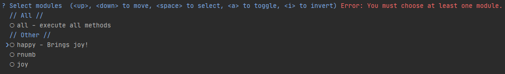

# ArgChooser

ArgChooser is Python module which allows for fast and easy creation of function chooser.

  - Gives end-user an option to choose which functions to execute by cmdline args or cmdline menu 
  - Just add flag names and functions
  - Execute and watch magic!

## Table of Contents

1. [Documentation](#documentation)  
    1. [Installation](#installation)  
    2. [Quick Start](#quick-start)  
    3. [Examples](#examples)
2. [License](#license)

## Documentation

### Installation

Simply use pip to install the ArgChooser package
```shell script
pip install argchoose
```

### Quick Start

Using ArgChooser is as simple as possible. Simple three steps:
+ **Create** object of ArgChooser
+ **Bind** methods with flags using add_argument
+ **Execute** ArgChooser!

```python
from argchoose import ArgChooser

def foo():
    print('bar')

ac = ArgChooser()
ac.add_argument('-f', '--foo', method=foo)
ac.execute()
```

Now You are able to run your program from cmdline like that to execute method:

```python
python example.py -f
```
Or without flags to see this:


### Examples

1. [Adding arguments](#adding-arguments)
2. [Changing default ArgChooser parameters](#changing-default-argchooser-parameters)

#### Adding arguments

``add_argument`` - allows to bind flag (or flags) with chosen method.
It is possible to also specify category and help prompt.

Takes ``*flags: str``, ``method: Callable`` [, ``help: str``, ``category: str``]

Returns nothing.

Example is based on [This](./examples/default_usage.py "This").

Categories allows to make menu clearer.


As You can see, ``help`` also makes it more descriptive, but also could be printed using -h flag like cmdline tools usually do!

```shell script
python default_usage.py -h
```


To execute chosen methods, end-user has to choose, if they want to use it straight from cmdline or menu:


#### Changing default ArgChooser parameters

``ArgChooser`` could be initialized without any parameters, but gives possibility to change a few little things as shown [Here](./examples/init_arguments.py "Here").

Takes [``category_style: str``, ``default_category_name: str``, ``style: Dict[Token, str]``, ``validation_func: Callable(List) -> bool``, ``validation_error: str``].

``category_style`` is string on which is used format method with category name.  
 ``{}`` must be included in string.  
 Default is ``== {} ==``.

``default_category_name`` is string which will be used as category name for every uncategorized methods.
Default is ``Other``.

``style`` is dictionary made from ``Token``s and strings which represents hex colors with textformatting keywords (like ``bold``).

``validation_func`` is function used for validating answers at the end of parsing (for example for checking if amount of answers is bigger than two).  
This function must take one argument which is ``List`` and must return ``bool`` value.  
Default functions checks if any answer is chosen.

``validation_error`` is string which will be printed if ``validation_func`` returned ``False``.  
Default is ``You must choose at least one module.``.


When ``validation_func`` return ``False``, ``validation_error`` is printed like that:


This is going to be changed to this, after releasing new version of PyInquirer with fixed ``validation`` parameter:




## License
Copyright (c) 2020 Paweł Kusiński  
Distributed under the MIT License. See ``LICENSE`` for more information.